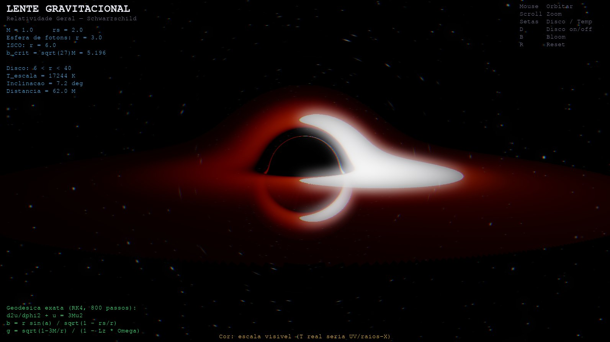
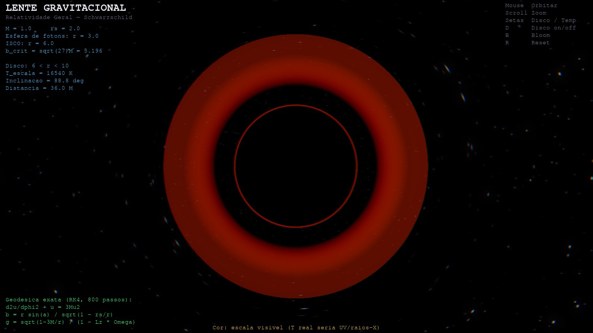
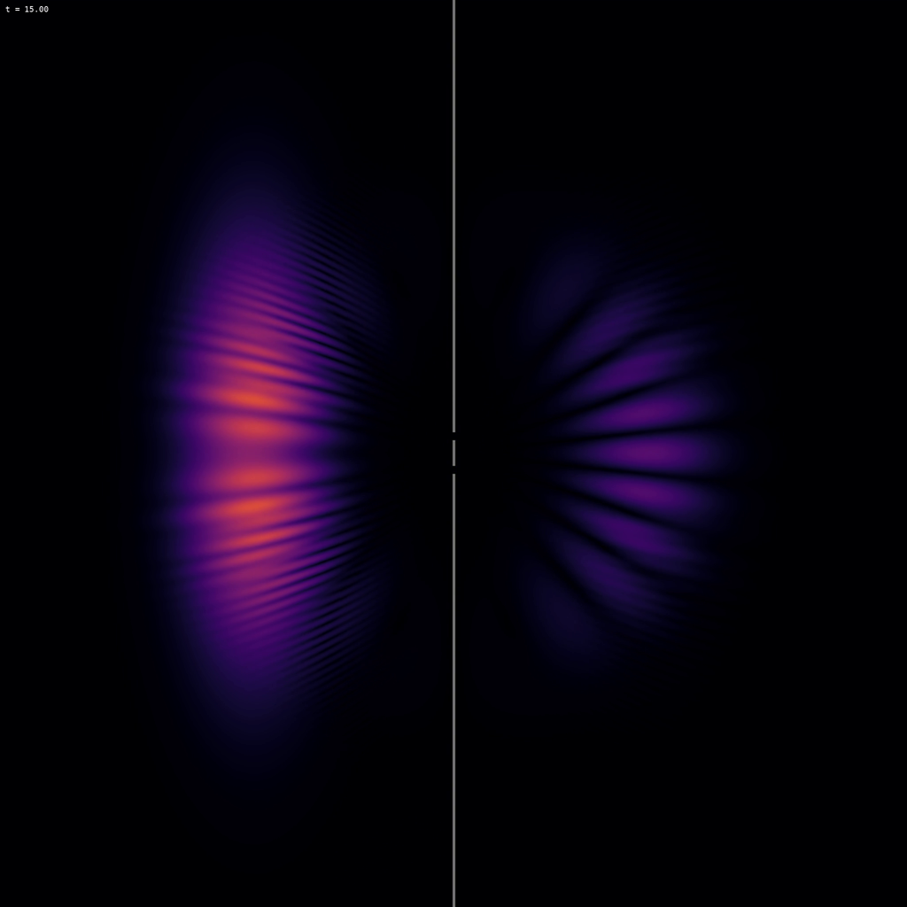
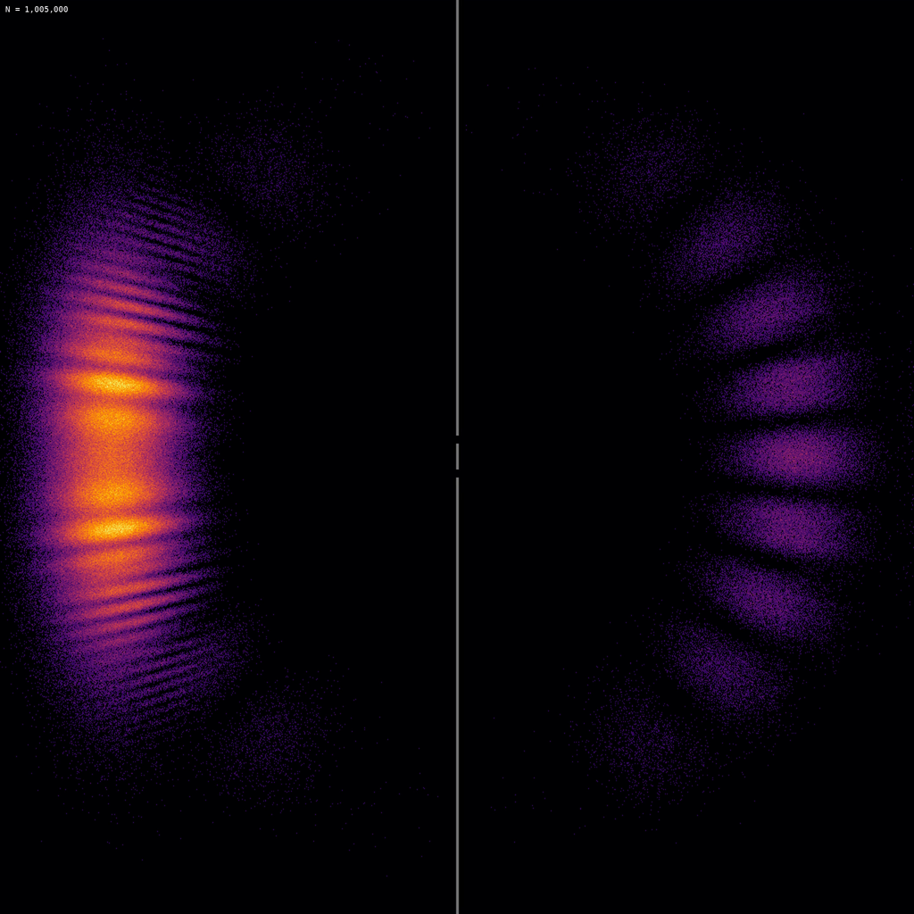
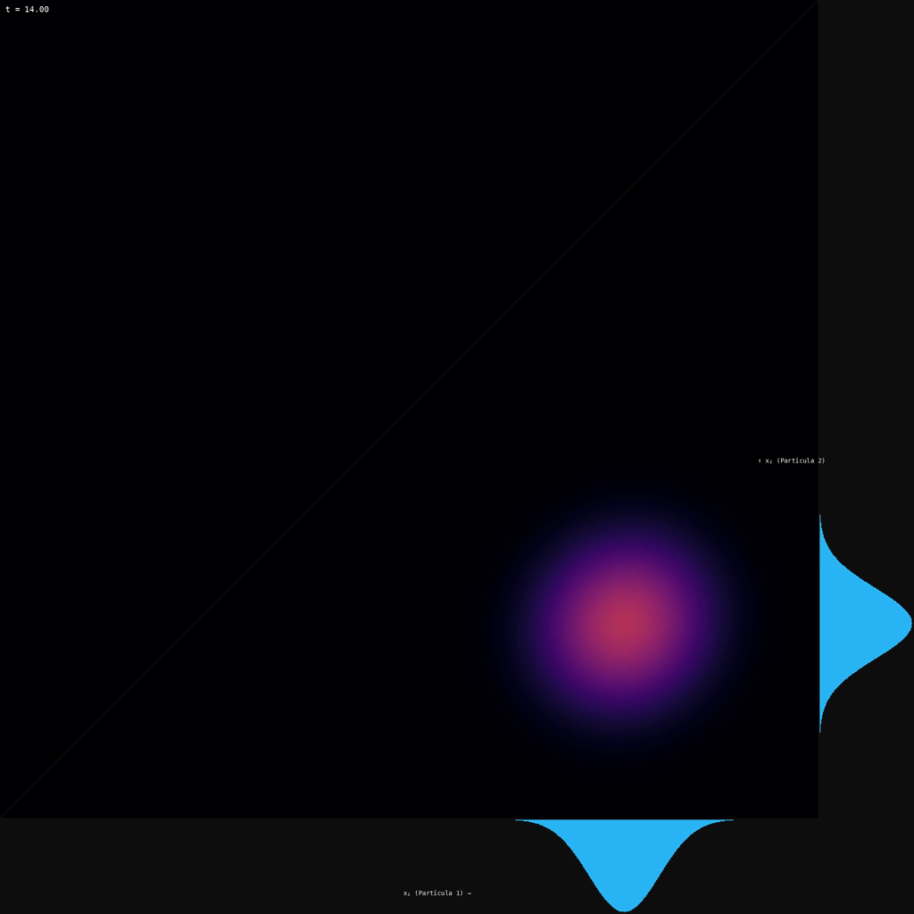
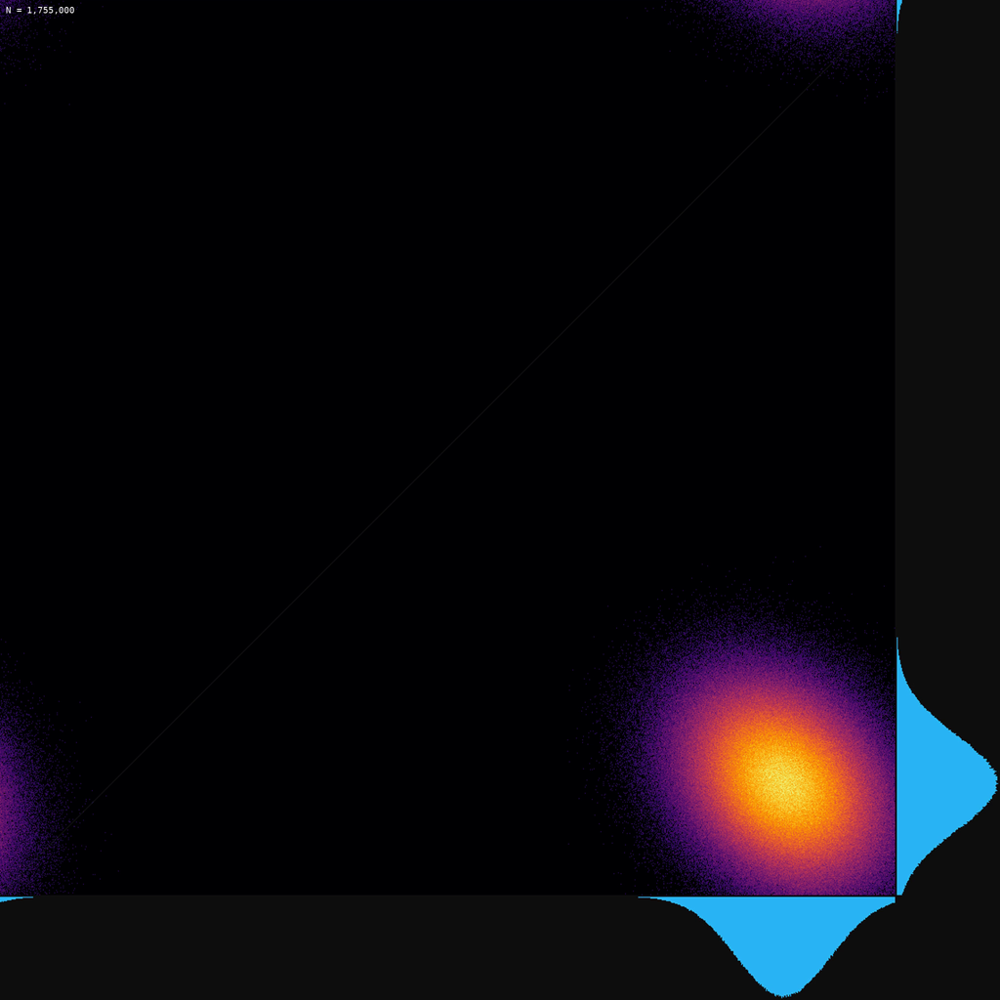
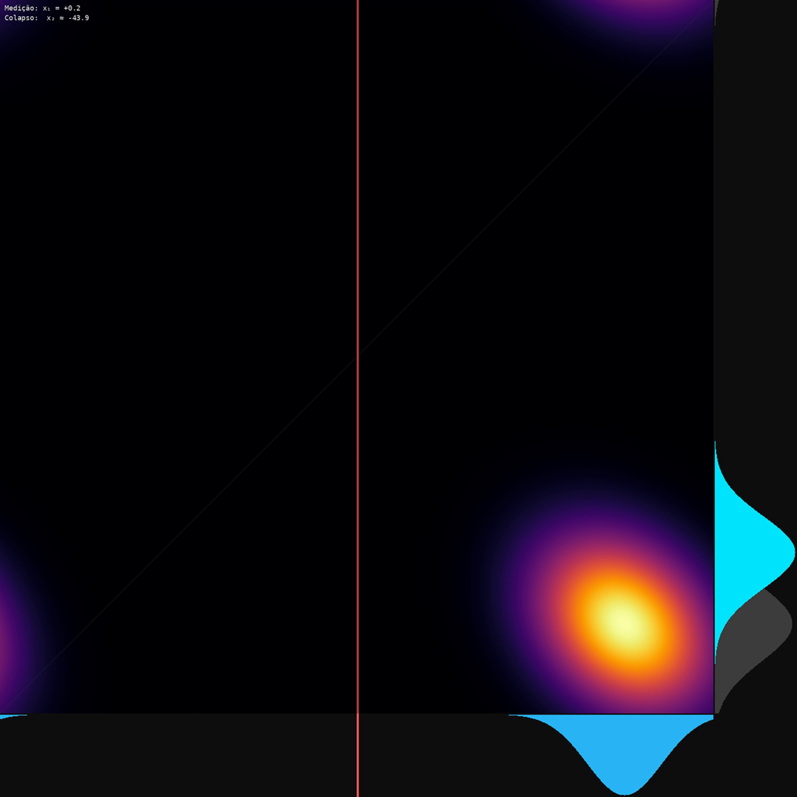
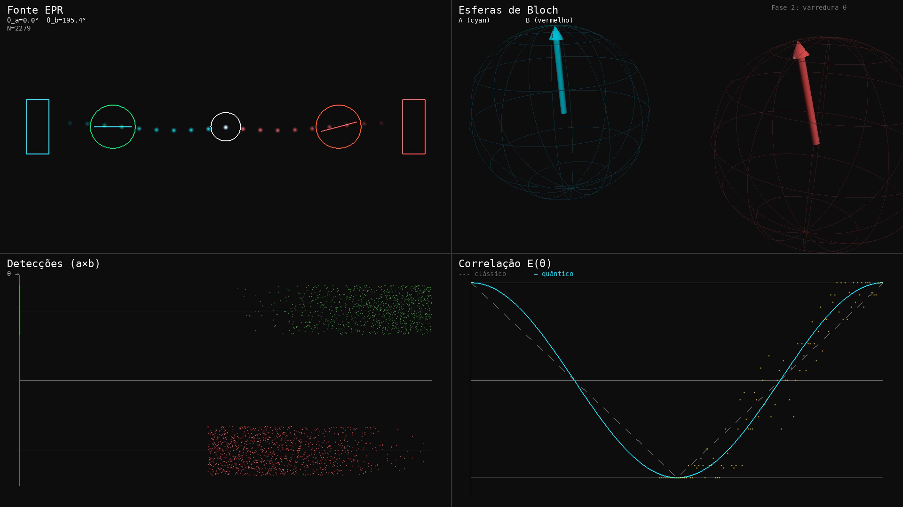

<div align="center">

# ⚛ Physics Lab

**Simulações interativas de Física Moderna — da equação de Schrödinger à curvatura do espaço-tempo**

GPU-accelerated · Geodésicas exatas · OpenGL / GLSL · Python

<br>



<sub>Lente gravitacional de Schwarzschild — 800 passos RK4 por pixel, disco de acreção com Doppler relativístico e perfil Novikov–Thorne</sub>

</div>

---

## Sobre

Physics Lab é uma coleção de experimentos computacionais que simulam fenômenos de mecânica quântica, relatividade restrita e relatividade geral. Cada experimento implementa a física real — sem atalhos, sem aproximações grosseiras — e renderiza os resultados em tempo real via OpenGL/ModernGL ou gera vídeos de alta qualidade via ffmpeg.

O projeto foi construído com foco em três princípios: **fidelidade física** (equações exatas, métodos numéricos validados), **performance** (shaders GPU, Split-Step FFT, CuPy quando disponível) e **clareza pedagógica** (HUDs com parâmetros em tempo real, controles interativos para explorar o espaço de parâmetros).

---

## Experimentos

### Relatividade Geral

#### `01` · Lente Gravitacional — Schwarzschild

Simulação interativa de um buraco negro de Schwarzschild com ray tracing geodésico exato. Cada pixel da tela dispara um fóton cuja trajetória é integrada pela equação de órbita na métrica de Schwarzschild.

**Física implementada:**

- Equação de órbita de fótons: `d²u/dφ² + u = 3Mu²` (u = 1/r, unidades geométricas G = c = 1)
- Integração Runge-Kutta 4ª ordem (800 passos por raio)
- Horizonte de eventos em r = 2M, esfera de fótons em r = 3M, ISCO em r = 6M
- Parâmetro de impacto: `b = r₀ sin(α) / √(1 − rₛ/r₀)`
- Disco de acreção com perfil de temperatura Novikov–Thorne: `T(r) ∝ [f(r)/r³]^(1/4)`
- Redshift gravitacional: `g_grav = √(1 − 3M/r)`
- Doppler relativístico: `g = g_grav / (1 − Lz·Ω)` com `Ω = √(M/r³)`
- Intensidade observada: `I_obs ∝ g⁴ · B(g·T)` (invariância relativística)
- Conversão blackbody → sRGB (aproximação de Mitchell Charity)
- Campo estelar procedural com lensing gravitacional

**Controles:** Mouse (orbitar), Scroll (zoom), Setas (disco/temperatura), D (disco on/off), B (bloom), R (reset)

<div align="center">

<br>
<sub>Vista quase polar (88.8°) — o anel de Einstein aparece como imagem secundária dentro da sombra do buraco negro</sub>
</div>

---

### Mecânica Quântica

#### `01` · Tunelamento Quântico — Schrödinger 1D

Pacote de onda gaussiano incidindo em uma barreira retangular de potencial. Resolve a equação de Schrödinger 1D dependente do tempo via **Split-Step Fourier** (2ª ordem simétrica):

```
ψ → exp(−iV dt/2) · ψ        meio-passo no espaço de posição
ψ → FFT → exp(−ik²/2 dt) · ψ̃  passo completo no espaço de momento
ψ → IFFT → exp(−iV dt/2) · ψ  meio-passo no espaço de posição
```

Grade de 2048 pontos, unidades naturais (ℏ = 1, m = 1). O pacote de onda tem energia cinética E = 12.5, a barreira tem altura V₀ = 15 — regime de tunelamento clássico proibido, mas quanticamente permitido.

<div align="center">

<br>
<sub>t = 4.80 — pacote de onda atingindo a barreira, com parte já transmitida por tunelamento quântico</sub>
<br><br>

<br>
<sub>t = 8.80 — após a interação: pacote refletido (esquerda) e transmitido (direita), demonstrando tunelamento através de barreira classicamente proibida</sub>
</div>

---

#### `02` · Dupla Fenda — Interferência e Colapso

Schrödinger 2D em grade de 1024×1024 (1M células), GPU-accelerated via CuPy. Simula um pacote de onda passando por uma dupla fenda e formando o padrão de interferência. Inclui simulação de colapso da função de onda com detecção posicional.

<div align="center">

<br>
<sub>t = 15.0 — |ψ(x,y)|² após passagem pela dupla fenda, mostrando o padrão de interferência quântica</sub>
<br><br>

<br>
<sub>N = 1.005.000 detecções — o histograma de colapsos reproduz o padrão de interferência de |ψ|²</sub>
</div>

---

#### `03` · Emaranhamento Quântico (EPR)

Par de partículas em estado emaranhado voando em direções opostas. Função de onda em 2D: `ψ(x₁,x₂) ∝ exp(−(x₁−x₂)²/4σᵣ²) · exp(−(x₁+x₂)²/4σᵣ²) · exp(ik₀(x₁−x₂))`. Grade de 1024×1024 com GPU. Gera três vídeos: evolução de |ψ|², 2 milhões de detecções revelando correlações, e colapso instantâneo ao medir uma partícula.

<div align="center">

<br>
<sub>|ψ(x₁,x₂)|² em t = 14.0 — a distribuição conjunta no espaço (x₁, x₂) mostra correlação ao longo da diagonal, enquanto as distribuições marginais (projeções) são amplas</sub>
<br><br>

<br>
<sub>N = 1.755.000 detecções — o scatter plot (x₁, x₂) revela a correlação do emaranhamento: medir x₁ determina x₂</sub>
<br><br>

<br>
<sub>Medição de x₁ = +0.2 colapsa instantaneamente x₂ para −43.9 — a linha vermelha marca o corte da medição no espaço de configuração</sub>
</div>

---

#### `04` · Teste de Bell (CHSH)

Simulação completa do teste de Bell com o estado |Φ+⟩ = (|00⟩ + |11⟩)/√2. Renderização OpenGL com 4 painéis sincronizados (1920×1080) mostrando a violação da desigualdade de Bell via protocolo CHSH:

```
S = E(a₁,b₁) − E(a₁,b₂) + E(a₂,b₁) + E(a₂,b₂) = 2√2 ≈ 2.83 > 2
```

O valor S = 2√2 (limite de Tsirelson) viola o limite clássico S ≤ 2, descartando teorias de variáveis ocultas locais.

<div align="center">

<br>
<sub>Fase 2: varredura angular θ — os 4 painéis mostram fonte EPR, esferas de Bloch (Alice e Bob), scatter de detecções (a×b), e correlação E(θ) vs previsão clássica e quântica</sub>
<br><br>

<br>
<sub>Resultado final: S = 2.87 > 2 — violação da desigualdade de Bell confirmada, consistente com o limite quântico de 2√2 ≈ 2.83</sub>
</div>

---

### Relatividade Restrita

#### `01` · Dilatação Temporal

Dois relógios analógicos procedurais renderizados via fragment shader. O relógio estacionário marca o tempo coordenado *t*, enquanto o relógio em movimento marca o tempo próprio *τ = t/γ*. O fator de Lorentz `γ = 1/√(1 − v²/c²)` atrasa visualmente o ponteiro do relógio em movimento em tempo real.

#### `02` · Contração de Lorentz

Um cubo e uma esfera lado a lado, com wireframes-fantasma mostrando o tamanho de repouso L₀ e formas sólidas mostrando o comprimento contraído `L = L₀/γ`. A contração acontece inteiramente no vertex shader da GPU — cada vértice é comprimido ao longo do eixo de movimento pelo fator `1/γ = √(1 − v²/c²)`.

#### `03` · Transformadas de Lorentz

Diagrama de Minkowski inteiramente procedural (fragment shader). Dois referenciais sobrepostos: S (azul, ortogonal) e S' (âmbar, inclinado). Três cenários interativos: relatividade da simultaneidade, cone de luz e causalidade, inversão de ordem temporal.

#### `04` · Paradoxo dos Gêmeos

Gêmeo A fica na Terra; Gêmeo B viaja até uma estrela distante a velocidade v e retorna. Quando se reencontram, B é mais jovem: `τ_B = T/γ < T = τ_A`. A simulação mostra a assimetria que vem da mudança de referencial na meia-volta (aceleração), resolvendo o "paradoxo".

---

## Arquitetura

```
physics-lab/
├── relatividade geral/
│   └── 01-lente-gravitacional/    # Ray tracing geodésico (GLSL)
│       ├── main.py                # App interativa (Pygame + ModernGL)
│       └── shaders/
│           └── blackhole.frag     # RK4 no fragment shader
├── relatividade restrita/
│   ├── common/                    # Engine compartilhado
│   │   ├── engine.py              # BaseApp, bloom, câmera orbital, HUD
│   │   └── shaders/               # Bloom, grid, starfield, compositing
│   ├── 01-dilatacao-temporal/
│   ├── 02-contracao-lorentz/
│   ├── 03-transformadas-lorentz/
│   └── 04-paradoxo-gemeos/
├── mecanica quantica/
│   ├── 01-schrodinger-1d/         # Split-Step Fourier 1D
│   ├── 02-dupla-fenda-colapso/    # Split-Step Fourier 2D (CuPy/GPU)
│   ├── 03-emaranhamento/          # EPR com 2M detecções
│   └── 04-bell-test/              # CHSH com OpenGL renderer
└── requirements.txt
```

O engine compartilhado (`common/engine.py`) fornece: contexto OpenGL 3.3 Core via Pygame, pipeline de bloom HDR (extract → blur Gaussiano multi-pass → composite), câmera orbital com mouse, sistema de HUD com fontes procedurais, e framework de full-screen quad para shaders de ray tracing.

---

## Instalação

```bash
git clone https://github.com/JoaoHenriqueBarbosa/physics-lab.git
cd physics-lab
pip install -r requirements.txt
```

**Dependências:** NumPy, Matplotlib, Pygame, ModernGL. Para aceleração GPU nos experimentos de mecânica quântica 2D, instale também [CuPy](https://cupy.dev/) (opcional — funciona com NumPy puro, porém mais lento).

**Requisitos de sistema:** OpenGL 3.3+ (qualquer GPU dedicada ou integrada dos últimos ~10 anos).

### Executando

```bash
# Relatividade Geral — buraco negro interativo
python "relatividade geral/01-lente-gravitacional/main.py"

# Relatividade Restrita — dilatação temporal
python "relatividade restrita/01-dilatacao-temporal/main.py"

# Mecânica Quântica — tunelamento (interativo)
python "mecanica quantica/01-schrodinger-1d/main.py"

# Mecânica Quântica — dupla fenda (gera vídeo)
python "mecanica quantica/02-dupla-fenda-colapso/main.py" --save
```

---

## Referências

- Schwarzschild, K. (1916) — Métrica de Schwarzschild
- Luminet, J.-P. (1979) — *Image of a Spherical Black Hole with Thin Accretion Disk*, Astron. Astrophys. 75, 228–235
- Novikov, I. D. & Thorne, K. S. (1973) — *Black Holes* (Les Houches)
- James, O. et al. (2015) — *Gravitational Lensing by Spinning Black Holes in Astrophysics, and in the Movie Interstellar*, Class. Quant. Grav. 32, 065001
- Bruneton, E. (2020) — arXiv:2010.08735
- Clauser, J. F. et al. (1969) — Desigualdade CHSH

---

<div align="center">

Feito com física de verdade, café, e uma noite produtiva.

</div>
